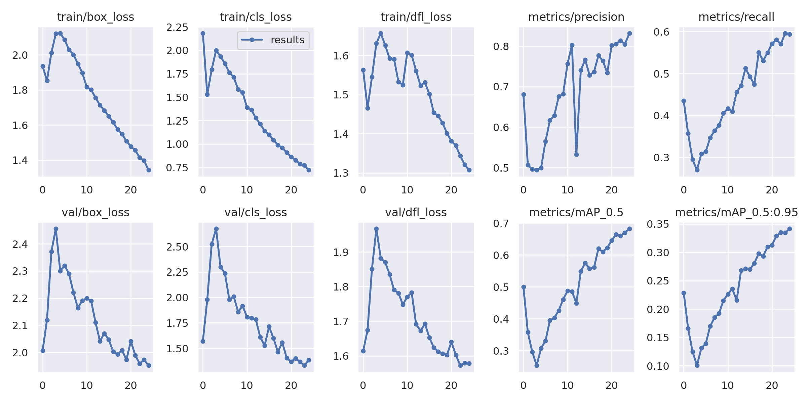
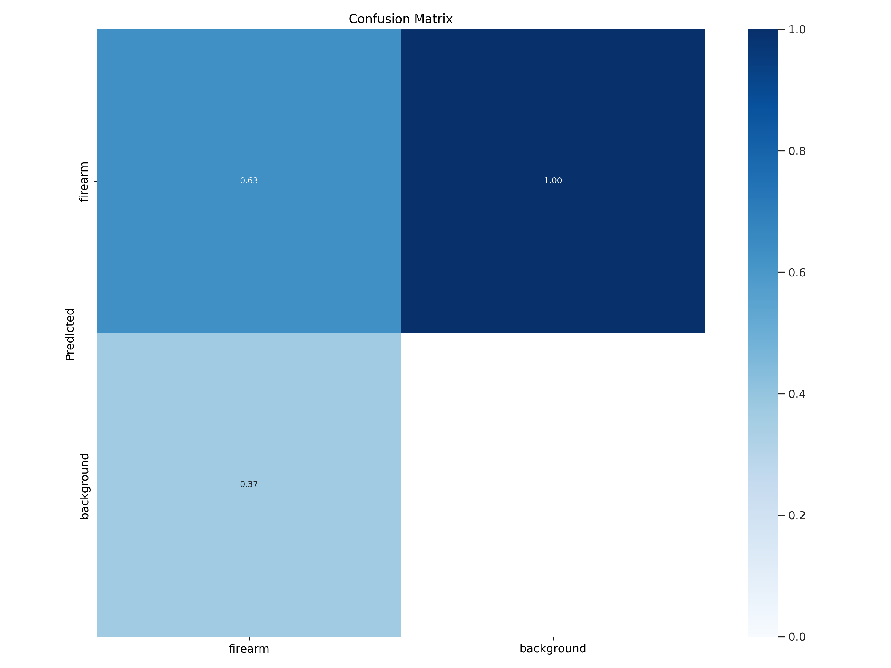

I try to build some simple projects when new YOLO versions come out. This time, I tried to build a firearm detector.

As always, the most difficult aspect of training YOLO models is preparing the dataset (at least for me). So this time too, I had too much work to do to prepare the dataset. While checking out datasets in [Roboflow Universe](https://universe.roboflow.com/), I knew that I needed a way to merge different datasets to increase the generalization power of the model. Unfortunately, there wasn't such a tool in the [supervision](https://supervision.roboflow.com/latest/) module so I had to prepare one for myself. [^1] I started by defining some requirements:

I needed to be able to,

- merge different datasets
- group similar labels together
- filter the labels that I don't want to include

and finally,

- datasets must have a similar structure (I picked COCO by default)

But that wasn't enough. Since I had picked COCO as my default dataset structure, I needed to transform the merged dataset to YOLO's supported format to set up the training phase. So, I needed to use COCO's outdated Python API.

I have found a rather [updated version](https://github.com/gautamchitnis/cocoapi) of it, so forked it and updated the API to make it compatible with my current workflow. ([my fork](https://github.com/alperiox/cocoapi))

Most of the work was done in the dataset preparation, but I was able to implement the functionality to merge datasets while also merging the labels (or filtering the unwanted ones). Check the messy colab notebook [here](https://colab.research.google.com/drive/1Sa1f7seL5CmiDl9reh9EAxFlk-LAPR39?usp=sharing) if you're interested. I plan to wrap it up into a simple script but in the future, please.

Training the model couldn't be easier, really. I used [Piotr Skalski's YOLOv9 fork](https://github.com/SkalskiP/yolov9) and simply trained the model for `10 epochs` using `16 samples` per batch and augmented the training samples using `mozaic augmentation` [^2]

The training results weren't as bad as I thought!

False negatives are critical in this project, as incorrect negative classification might have serious consequences. Thus, while the model had decent precision, having rather lower recall meant that there are impactful amount of false negatives. We can see that from the following confusion matrix as well

As a result, while the model does a decent job for a model trained in an hour or two, it's not ready to use in real-life applications where having false negatives would impact peoples lives.

# TODO: model onnx'e cevrildi, calisiyoda. ama detection pipeline'in duzenlenmesi gerekiyor, ona bakip devam etmek gerek

But hey, we can still build a `gradio` app to showcase the model! [It's live in huggingface]()

[^1]: there's a `merge` function in the `supervision` module, but it's just doesn't cover my use case where I want to merge multiple datasets while also filtering the respective **classes**.
[^2]: Mosaic data augmentation simply combines some training samples into one in certain ratios, it was first introduced in YOLOv4 and it lets model to learn how to identify smaller objects.
