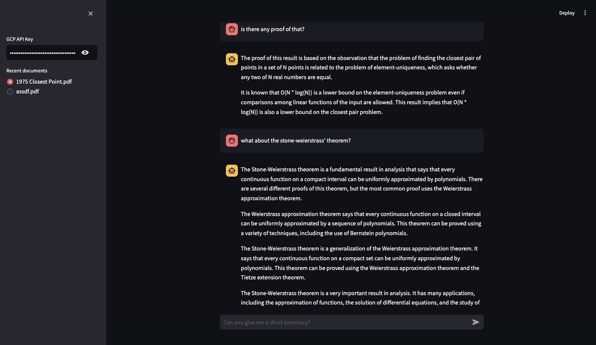

In order to improve my Upwork profile a little, I grabbed the most successful freelancers in AI and checked their projects. One of them was building a retrieval system for question answering with PDFs, so here we are.

I always lean on cloud providers when it comes to LLMs. This time too, I used Gemini with GCP. The project was rather simple, I needed to construct vector database, fetch documents and use them in the prompt that will generate the real answer. I also needed a graphical interface so I had to choose between Gradio or Streamlit.

My toolset was pretty simple, [Langchain](https://www.langchain.com/) for utilizing the LLM and setting up the retrieval system and [Streamlit](https://streamlit.io/) for the user interface. I defined several variables to store the session data in [Streamlit](https://streamlit.io/), specifically for storing the path of currently selected PDF, the list of uploaded documents, currently loaded vector store, and for the retrieval system.

I simply created a new Chroma vector database when a document is uploaded for the first time, the documents were splitted to chunks of `1000` characters and the embeddings were calculated using [VertexAI](https://cloud.google.com/vertex-ai)s embedding model, `textembedding-gecko`. The database was also stored in the filesystem with a random `uuid`. Loading the corresponding database when it's selected in the user interface was simple, the important thing was to set up the LLM chain successfully so we could retrieve the data from the database. And thankfully it was also easy thanks to [Langchain](https://www.langchain.com/).

And in the end, here's the finished version of it:

The project is not deployed on anywhere, but is [available on github](https://github.com/alperiox/rag-pdf-qna).
