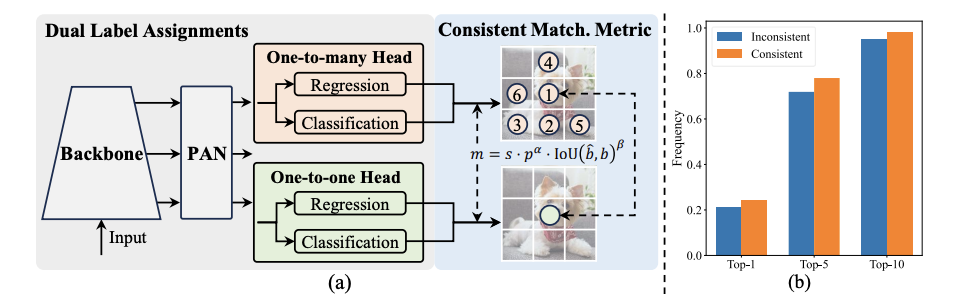
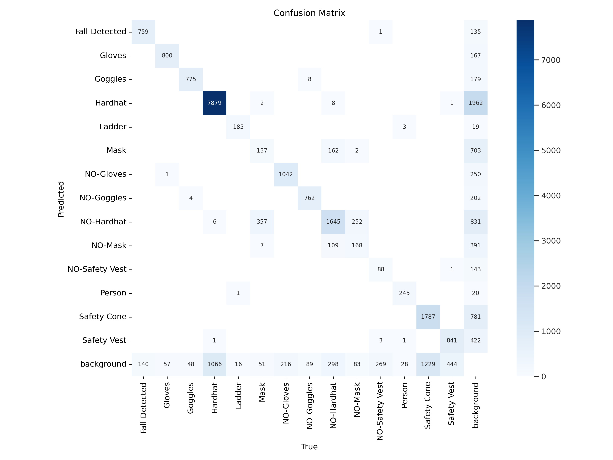
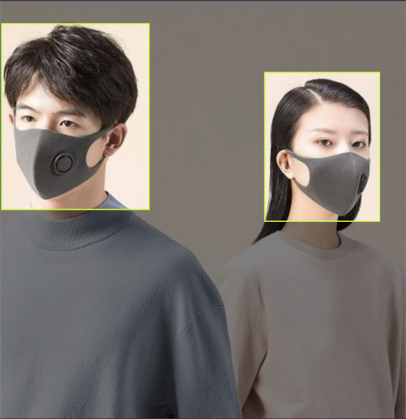
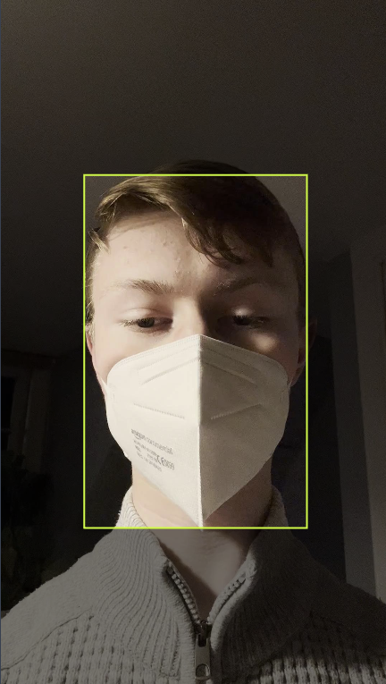
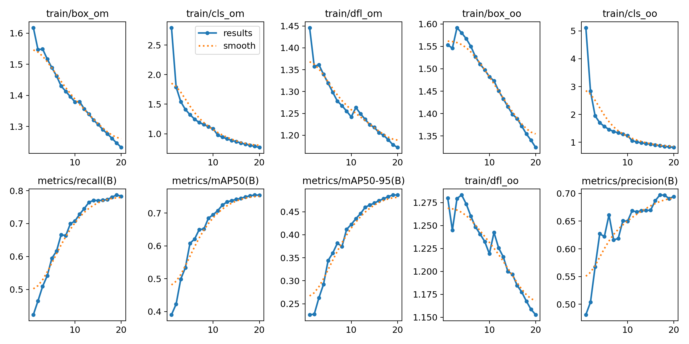

## Introduction

[Colab Notebook for training](https://colab.research.google.com/drive/1dCGbqEEylMX6bhj70rINF6QCuMIVcvbC?usp=sharing)

[Paper](https://arxiv.org/pdf/2405.14458)

As always, I built a simple model as the new YOLO version came out. This time, it was personal protective equipment detection.

The YOLOv10's modeling approach is just so cool! We usually get multiple assignments per instance in the given object, resulting in a one-to-many mapping. While this approach results in more supervisory signals, it also introduces inefficiencies in inference. Because we would need to apply an algorithm like [NMS](https://towardsdatascience.com/non-maximum-suppression-nms-93ce178e177c) to filter out redundant predictions.

So... YOLOv10 included a one-to-one mapping head to the model along with a one-to-many head. The authors introduce a **consistent matching metric** to quantitatively assess the level of concordance between predictions and instances, this metric also includes two hyperparameters. Then they derived a metric from the [Wasserstein-1](https://en.wikipedia.org/wiki/Wasserstein_metric)[metric](https://en.wikipedia.org/wiki/Wasserstein_metric) including the **consistent matching metric** to determine the supervision gap between two heads.

And in the end, it was possible to optimize the one-to-one head in the direction of the one-to-many head's optimization. Because the derived distance converges to 0 as the one-to-one head's prediction goes up in the ranks of one-to-many head's outputs. If they also choose the **consistent matching metric**'s hyperparameters well, then mathematically the best output from one-to-many is the best for one-to-one as well. This means that they can train the model using richer signals from one-to-many head and optimize the one-to-one head as well. This approach removes the need for [NMS](https://towardsdatascience.com/non-maximum-suppression-nms-93ce178e177c) in the inference phase, reducing the potential performance drawbacks.

I wanted to highlight a few things before moving on to my project. Because damn, training YOLO models are easy. Like really, really easy. Often, the most cumbersome part of the project is the data preparation phase, which is also much easier thanks to [Roboflow Universe](https://universe.roboflow.com/). So all you need to do is pick a dataset, download it in YOLO format, and run the training script.

Well, I just... did that too. Picked a dataset for PPE detection and ran the training script. I usually convert the model to ONNX before trying to deploy it, it was the same this time too. I prepared a simple demo as a [Huggingface Space](https://huggingface.co/spaces/alperiox/yolov10-ppe-detection). The training was pretty successful, as I trained the model with default hyperparameters for just 20 epochs.

### Results

It's easy to see that predicting a bounding box when the person doesn't have a glove, goggles, hard hat, mask or safety vest introduces a difficulty in predicting other labels. I think that's because there would be multiple similar bounding boxes with different labels.

I can imagine why `Mask`s are often confused with `NO-Hardhat` boxes, probably because of the data labeling part. When I checked the initial dataset, I could see there are similar images where `Mask` or `NO-Hardhat` labels both fit well. Like:

Mask             |  NO-Hardhat
:-------------------------:|:-------------------------:
  |  

Like, `NO-Hardhat` could be easily determined as `Mask` by a human like me. So I don't put it on the algorithm.

In the end, the model trained well but I think it could use some more training steps. I'm happy with the results though.

